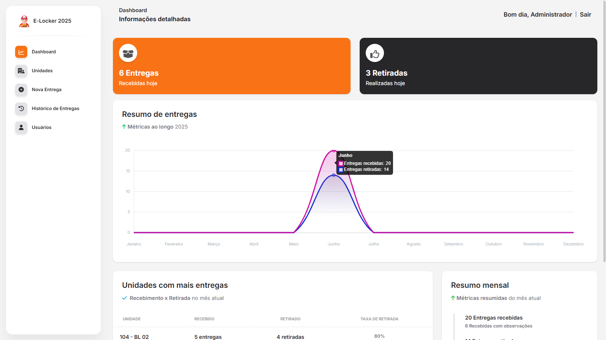
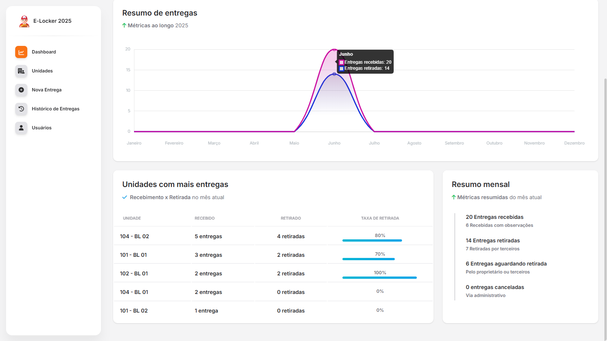
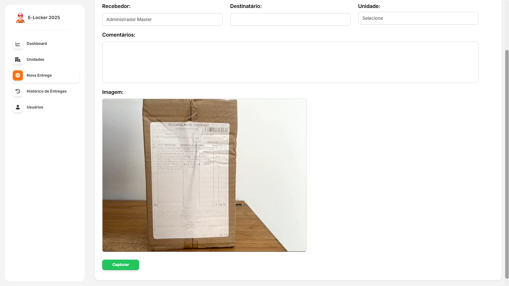
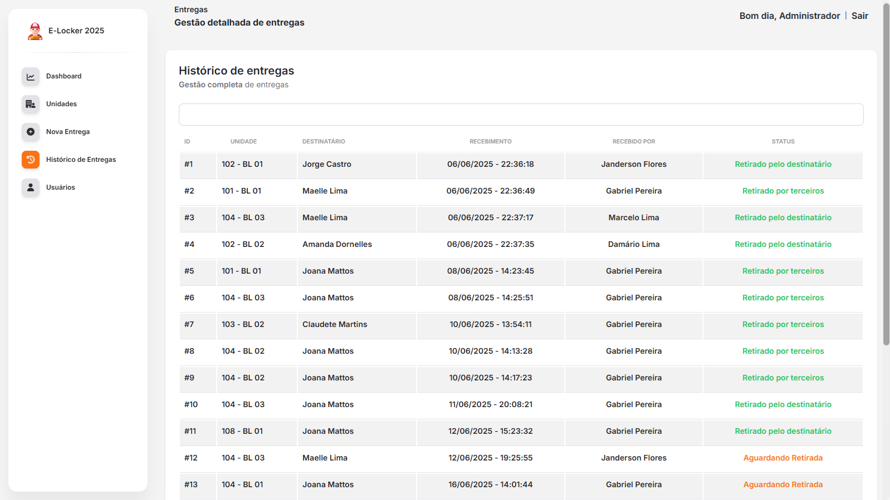
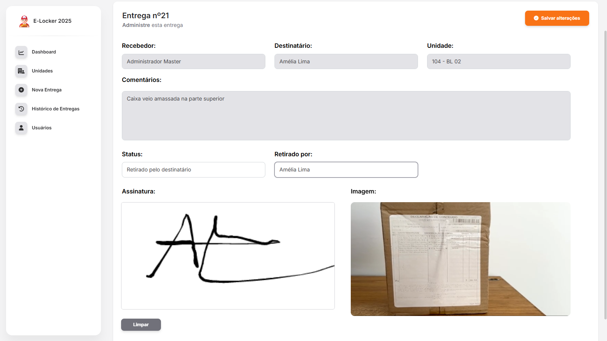
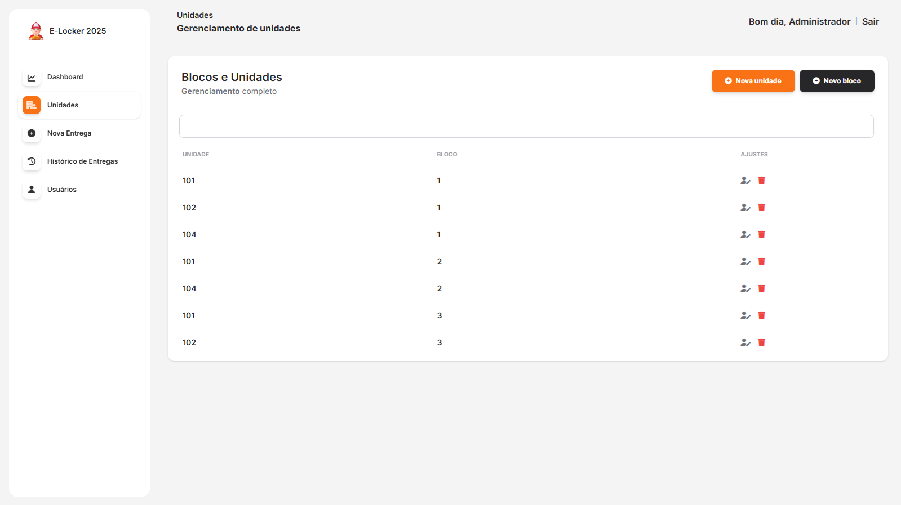
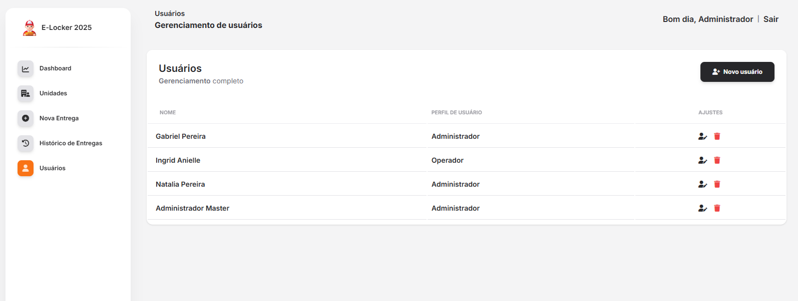

<p align="center"><a href="https://laravel.com" target="_blank"></a></p>

# E-Locker - Registro de Entregas
Sistema de registro de entregas para condomínios, que disponibiliza dois perfis de autenticação onde o usuário irá logar e registrar a encomenda recebida, cadastrando por nome do recebedor, nome do destinatário, foto, descrição e a unidade destinatária. 

Para a retirada da entrega, o mesmo registra o nome da pessoa que retirou, sua assinatura. Venha conferir!

## 🚀 Tecnologias Utilizadas no projeto

Front-end:
- HTML
- CSS
- JavaScript ES6
- Bootstrap
- Vue.Js
- LavaCharts
- Notyf
- SweetAlert2
- Signature Pad

Back-end:
- PHP
- Laravel
- MySql
- Livewire
- ACL

## ✨ Principais Funcionalidades

- Login com autenticação
- Validação de formulários
- Listagem e edição de dados
- Busca em tempo real de entregas via Id ou nome do cliente
- Gerenciamento de entregas
- Dashboard com comparativo de entregas ao longo dos meses
- Filtragem de entregas por mês
- Informações de unidades com mais entregas
- ACL para controle de permissões de usuário

Gerenciamento total (CRUD) de:

- Entregas
- Unidades
- Usuários

O sistema disponibiliza 2 (dois) tipos de usuário:

- Administrador
- Operador

## 🌐 O projeto está online!

Acesse em: (https://e-locker.online)

## 🛠️ Como rodar o projeto

1. Tenha em sua máquina um ambiente que faça a emulação de um servidor, como Xampp ou Docker instalado e parametrizado.
2. Clone o repositório:
```bash
git clone https://github.com/gabrieltec97/E-Locker.git
```
3. Copie o arquivo .env.example para .env
4. Instale as dependências com o Composer:
```bash
composer install
```
5. Gere a chave de API do Laravel.
```bash
php (ou sail) artisan key:generate
```
6. Parametrize crie seu banco de dados e preenchendo com as variáveis de nome do banco, usuário, senha e porta no arquivo .env.
7. Rode as migrations e seeders necessárias para dar a configuração inicial para o sistema executar corretamente.
```bash
php (ou sail) artisan migrate --seed
```
8. Inicie o servidor.
```bash
php (ou sail) artisan serve
```
9. Pronto! Agora é só acessar http://localhost:8000

## 📸 Screenshots

<h4>Com o usuário de administrador, acesse o dashboard informativo com gráfico de entregas recebidas x retiradas ao longo dos meses.</h4>



<h4>Ao rolar a página, você encontra o informativo das 5 unidades que mais recebem encomendas e sua taxa de retirada. Ao lado temos as informações gerais das entregas cadastradas.</h4>



<h4>O usuário de operador pode cadastrar uma nova entrega preenchendo os campos solicitados e tirando uma foto do pacote.</h4>



<h4>Você pode pesquisar e gerenciar as entregas via histórico.</h4>



<h4>Entregue o pacote ao destinatário ou a terceiros autorizados, colha a assinatura de quem retirou e dê baixa no sistema.</h4>



<h4>Com o usuário de administrador, faça a gestão completa de unidades do condomínio com bloco e unidade.</h4>



<h4>Gestão completa de usuários do sistema e seu perfil.</h4>


